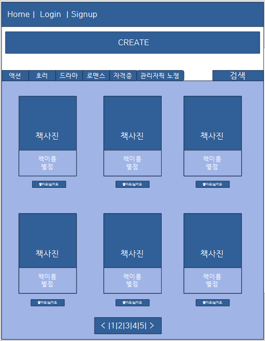
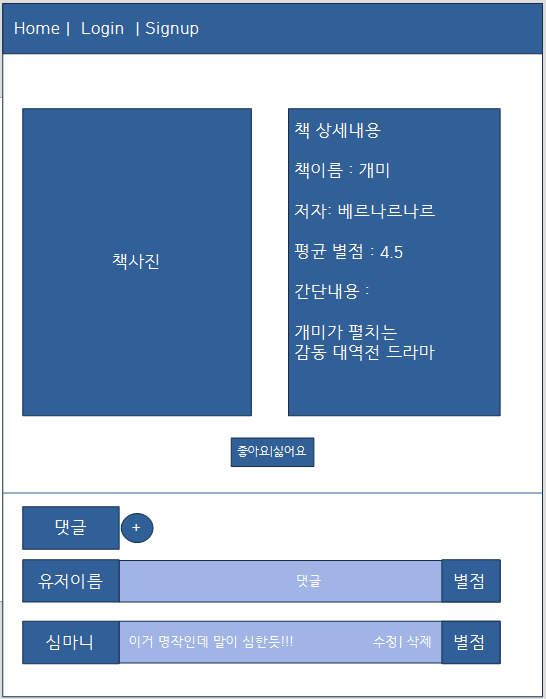
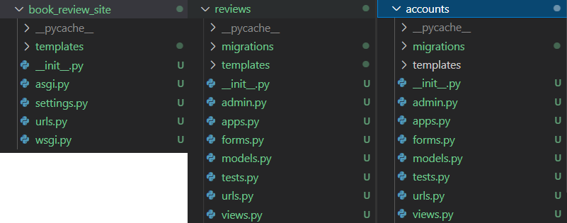
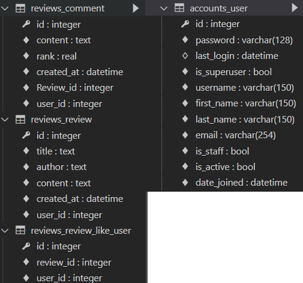

# pjt_book_review_board

읽은 책들을 올리고 리뷰를 올릴수 있는 게시판


## [04.03] 1일차  

### 계획

장고를 이용해서 책 리뷰를 올릴수있는 게시판을 만든다.

리뷰에는 좋아요를 할수있고, 댓글 역시 달을수있다.

책이 종류가 많은 만큼 카테고리를 지정해서 올릴수있도록하고 탭을 통해서 분류를 할수있게 한다.


- 계획한 index 페이지





- 상세페이지





### 무엇을 구현할지

- 부트스트랩을 적극적으로 이용할것 ( nav bar 와 책을 나타내는걸 카드로 나타낸다.)

- 책

  :책사진, 책이름, 저자, 간단한 소개내용으로 정보가 이루어져있다.

- 좋아요

  : 로그인 했다면 좋아요, 싫어요를 고를 수있고 그 수를 집계해서 index에 표현해준다.

- 회원가입

  :닉네임, 비밀번호 입력으로 끝낸다.

- 댓글

  : 로그아웃이되도 리뷰는 볼수있되, 댓글은 달지 못하도록한다.

  : 댓글을 달을때 별점을 매길수있다. 5점 만점으로 제한을 두고

  : 댓글들의 값을 평균을 내서 인덱스와 상세 페이지에 나타낼수있게함

  : 그러면 댓글에 필요한 요소는 유저, 댓글내용, 별점

- 검색

  : 책이름으로 url이 이동할수잇게 하고 없으면 404 에러뜨게 만든다.

- 카테고리

  : 책마다 종류가 다양하므로 카테고리를 만들어서 탭모양으로 바뀔수있게 만든다.


### 고민

- 회원가입하는 것이 의미가 있을까?

  : 회원가입을 만든이유는 무분별한 별점테러같은것이 없도록 번거로운 과정을 추가해서 막으려고 한것인데 그외 추가적인 기능없이 ''그것''만을 위해 있는것이 맞는가?

  - 추가적인 기능 생성: 프로필을 만들고 좋아요 리스트를 만들어서 추가기능 구현 

  - 회원가입삭제 : 익명의 닉네임으로 댓글을 달고 별점을 달수있게 만들기


## [04.05] 2일차


### 기본적인 틀을 제작




- book_review_site 로 프로젝트를 시작하였고

- 추가적인 앱을 책의 리뷰를 쓰는 reivews와 사용자의 정보를 넣을 수있는 accounts를 생성했다.
- book_review_site에는 index.html을 만들어 부트스트랩의 starter templates 만 넣어주었다.
- book_review_site의 urls.py에서 리뷰와 어카운트의 url로 진행할수있게 include 해주었다.


### 모델 설정

- 기본적인 유저 커스터마이징
- accounts/model.py

```python
from django.db import models
from django.contrib.auth.models import AbstractUser
# Create your models here.

class User(AbstractUser):
    pass
```

- accounts/forms.py

```python
from django.contrib.auth.forms import UserCreationForm
from django.contrib.auth import get_user_model

class CustomUserCreationForm(UserCreationForm):
    class Meta:
        model = get_user_model()
        fields = '__all__'
```


- 리뷰와 유저의 모델 설정
- review/model.py

```python
from django.db import models
from django.conf import settings
from django.core.validators import MinValueValidator, MaxValueValidator

# Create your models here.

class Review(models.Model):
    user = models.ForeignKey(settings.AUTH_USER_MODEL, on_delete=models.PROTECT) 
    # 올린사람의 정보
    title = models.TextField() # 책제목
    author = models.TextField() # 저자이름
    content = models.TextField() # 책내용
    created_at = models.DateTimeField(auto_now_add=True) # 리뷰 생성날짜
    like_user = models.ManyToManyField(settings.AUTH_USER_MODEL,related_name='like_book')
    # 좋아요하는 사람
    
    def __str__(self):
        return self.title #어드민에서는 책제목으로 보이게

class Comment(models.Model):
    user = models.ForeignKey(settings.AUTH_USER_MODEL, on_delete=models.CASCADE)
    # 댓글단 유저의 정보
    Review = models.ForeignKey(Review, on_delete=models.CASCADE) #댓글달은 리뷰의 정보
    content = models.TextField() # 댓글내용
    rank = models.FloatField(validators=[MinValueValidator(1), MaxValueValidator(5)])# 댓글에 점수를 매길수있는데 1점부터 5점까지 매길수있다.
    created_at = models.DateTimeField(auto_now_add=True) # 댓글 생성날짜

    def __str__(self):
        return self.content # 어드민에서 댓글내용으로 파악
```

- reviews/forms.py

```python
from django import forms
from .models import Review, Comment


class Review_Form(forms.ModelForm):

    class Meta:
        model = Review
        fields = '__all__'
    
class Comment_Form(forms.ModelForm):

    class Meta:
        model = Comment
        fields = '__all__'
```

- 고민인 것이 원래는 관리자가 책을 올려주고 거기에대해서 리뷰를 다는 방식으로 하려고 했다. 하지만 관리자가 24시간 책을 찾아서 올리는 것이 아니기 때문에 사용자도 올릴수있도록 하였다.
  - 단 여기서 같은 이름의 책은 올릴수가 없다. (중복을 판별하는것은 책이름과 저자이름) 
- 좀더 제한을 모델에서 줄수있을거라 생각한다. 좀더 찾아보기로 한다.
- 댓글작성시 점수를 줘서 그평균을 리뷰에도 나타나게 해서 리뷰에 랭크를 외래키로 등록해야하는데 에러가생긴다. (그런데 굳이 외래키로 줘야할 이유가 있을까?) 


### migrate




- 일단 migrate가 되는지 확인해 보았고 다음 진행작업에 model 을 한번더 생각해보고 다시 migrate 하겠다.


-----------

### 필요 링크

- 페이지네이션

  https://getbootstrap.com/docs/5.0/components/pagination/

- 좋아요, 싫어요 폰트

  https://fontawesome.com/icons?d=gallery&p=2&q=thumb

- heroku
- pythonanywhere
- lightsail

