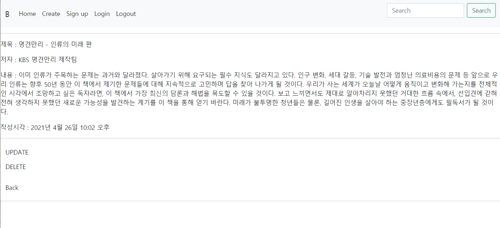

# pjt_book_review_board

읽은 책들을 올리고 리뷰를 올릴수 있는 게시판


## [04.03] 1일차  

### 계획

장고를 이용해서 책 리뷰를 올릴수있는 게시판을 만든다.

리뷰에는 좋아요를 할수있고, 댓글 역시 달을수있다.

책이 종류가 많은 만큼 카테고리를 지정해서 올릴수있도록하고 탭을 통해서 분류를 할수있게 한다.


- 계획한 index 페이지


- 상세페이지


### 무엇을 구현할지

- 부트스트랩을 적극적으로 이용할것 ( nav bar 와 책을 나타내는걸 카드로 나타낸다.)

- 책

  :책사진, 책이름, 저자, 간단한 소개내용으로 정보가 이루어져있다.

- 좋아요

  : 로그인 했다면 좋아요, 싫어요를 고를 수있고 그 수를 집계해서 index에 표현해준다.

- 회원가입

  :닉네임, 비밀번호 입력으로 끝낸다.

- 댓글

  : 로그아웃이되도 리뷰는 볼수있되, 댓글은 달지 못하도록한다.

  : 댓글을 달을때 별점을 매길수있다. 5점 만점으로 제한을 두고

  : 댓글들의 값을 평균을 내서 인덱스와 상세 페이지에 나타낼수있게함

  : 그러면 댓글에 필요한 요소는 유저, 댓글내용, 별점

- 검색

  : 책이름으로 url이 이동할수잇게 하고 없으면 404 에러뜨게 만든다.

- 카테고리

  : 책마다 종류가 다양하므로 카테고리를 만들어서 탭모양으로 바뀔수있게 만든다.


### 고민

- 회원가입하는 것이 의미가 있을까?

  : 회원가입을 만든이유는 무분별한 별점테러같은것이 없도록 번거로운 과정을 추가해서 막으려고 한것인데 그외 추가적인 기능없이 ''그것''만을 위해 있는것이 맞는가?

  - 추가적인 기능 생성: 프로필을 만들고 좋아요 리스트를 만들어서 추가기능 구현 

  - 회원가입삭제 : 익명의 닉네임으로 댓글을 달고 별점을 달수있게 만들기


## [04.05] 2일차


### 기본적인 틀을 제작


- book_review_site 로 프로젝트를 시작하였고

- 추가적인 앱을 책의 리뷰를 쓰는 reivews와 사용자의 정보를 넣을 수있는 accounts를 생성했다.
- book_review_site에는 index.html을 만들어 부트스트랩의 starter templates 만 넣어주었다.
- book_review_site의 urls.py에서 리뷰와 어카운트의 url로 진행할수있게 include 해주었다.


### 모델 설정

- 기본적인 유저 커스터마이징
- accounts/model.py

```python
from django.db import models
from django.contrib.auth.models import AbstractUser
# Create your models here.

class User(AbstractUser):
    pass
```

- accounts/forms.py

```python
from django.contrib.auth.forms import UserCreationForm
from django.contrib.auth import get_user_model

class CustomUserCreationForm(UserCreationForm):
    class Meta:
        model = get_user_model()
        fields = '__all__'
```


- 리뷰와 유저의 모델 설정
- review/model.py

```python
from django.db import models
from django.conf import settings
from django.core.validators import MinValueValidator, MaxValueValidator

# Create your models here.

class Review(models.Model):
    user = models.ForeignKey(settings.AUTH_USER_MODEL, on_delete=models.PROTECT) 
    # 올린사람의 정보
    title = models.TextField() # 책제목
    author = models.TextField() # 저자이름
    content = models.TextField() # 책내용
    created_at = models.DateTimeField(auto_now_add=True) # 리뷰 생성날짜
    like_user = models.ManyToManyField(settings.AUTH_USER_MODEL,related_name='like_book')
    # 좋아요하는 사람
    
    def __str__(self):
        return self.title #어드민에서는 책제목으로 보이게

class Comment(models.Model):
    user = models.ForeignKey(settings.AUTH_USER_MODEL, on_delete=models.CASCADE)
    # 댓글단 유저의 정보
    Review = models.ForeignKey(Review, on_delete=models.CASCADE) #댓글달은 리뷰의 정보
    content = models.TextField() # 댓글내용
    rank = models.FloatField(validators=[MinValueValidator(1), MaxValueValidator(5)])# 댓글에 점수를 매길수있는데 1점부터 5점까지 매길수있다.
    created_at = models.DateTimeField(auto_now_add=True) # 댓글 생성날짜

    def __str__(self):
        return self.content # 어드민에서 댓글내용으로 파악
```

- reviews/forms.py

```python
from django import forms
from .models import Review, Comment


class Review_Form(forms.ModelForm):

    class Meta:
        model = Review
        fields = '__all__'
    
class Comment_Form(forms.ModelForm):

    class Meta:
        model = Comment
        fields = '__all__'
```

- 고민인 것이 원래는 관리자가 책을 올려주고 거기에대해서 리뷰를 다는 방식으로 하려고 했다. 하지만 관리자가 24시간 책을 찾아서 올리는 것이 아니기 때문에 사용자도 올릴수있도록 하였다.
  - 단 여기서 같은 이름의 책은 올릴수가 없다. (중복을 판별하는것은 책이름과 저자이름) 
- 좀더 제한을 모델에서 줄수있을거라 생각한다. 좀더 찾아보기로 한다.
- 댓글작성시 점수를 줘서 그평균을 리뷰에도 나타나게 해서 리뷰에 랭크를 외래키로 등록해야하는데 에러가생긴다. (그런데 굳이 외래키로 줘야할 이유가 있을까?) 


### migrate


- 일단 migrate가 되는지 확인해 보았고 다음 진행작업에 model 을 한번더 생각해보고 다시 migrate 하겠다.


## [04.09, 04.11] 3, 4일차


### migrate


- 저번 rank에 대한 생각으로 한번 외래키로 넣어서 시도했으나 Review에서 이미 선언되지 않은 Comment의 키를 받아오는 것이 안되는 것같다.
- 그래서 rank의 외래키는 넣어두지않고 Comment의 rank로 표현할수있을거라 생각하기 때문에 외래키는 접어두고 migrate 했다.


### CRUD 구현

모델을 만들었으니 책리뷰글을 **생성**, **읽기**, **업데이트**, **삭제** 하는 기능을 넣어주려고 한다.

- 구현하면서 review 보다는 책에 대한 것이 중점이라고 생각해서 reviews가 아닌 books 로변경했다. 
- accounts 를 구현하게 되면 login-required 같은 인증또한 넣을 예정이다.


- urls.py


- books/views.py


### html 구현

views.py 까지 작성하고 나서 html를 작성하려는데 문제가 발생!

html에서 base.html 확장시키려는데 `block`이 먹질 않는다.

버전도 Django html로 되있고 다 정상인데 안될이유가 없는데... 스택오버플로우에서도 답을 찾지 못해서 따로 질문올리고서 다음날 다시 시도했다.

그런데 뭔일있었냐는듯 다음날 그대로 해결되었다. :angry:   뭔가 문제엿던거니..


- html 은 일단 서버에 제대로 나타는지 확인하기 위해서 값을 받고 추후에 꾸밈같은 걸 해줄 예정


- create.html


- detail.html


- index.html


- update.html


### 생성된 페이지

- index 페이지


- 생성 페이지


### 다음 계획

- 디테일 페이지는 오류가 생긴다. Book_from.pk 가 존재하지 않는다는데 다음 작업때 살펴봐야할 부분이다.
- CRUD 를 마무리 시키고 가능하면 comment 기능도 할수있다면 최대한 할것이다. comment에서 별점을 매겨서 book의 평점을 나타내야하기 때문에 이부분은 고민을 많이 하게 될것같다.


-----------

### [04.26] 5일차


### 문제 해결

Book_from.pk 가 존재하지 않는다 라는 문제를 겪었었는데 book의 pk를 'pk'로 공통적으로 바꿔준 결과 해결되어 detail 페이지를 정상적으로 확인할 수 있었다. 


### index 페이지 개선 (+navbar)

- 기존의 인덱스 페이지가 무엇을 나타내는지 알기 힘들었고 웹페이지상에서 무질서해 보였다.

- 이를 부트스랩의 카드를 가지고 이용해 웹사이트의 책 리뷰들을 그리드 시스템을 통해서 반응형으로 될수있도록 깔끔하게 나타냈다.

  - https://getbootstrap.com/docs/5.0/components/card

- 리뷰 생성의 경우 버튼을 통해서 생성할수있도록 설계했다.

- nav bar의 경우 필요한기능인 index 로 이동하는 'Home' 과 리뷰생성하는 'Create' 을 넣었고

  회원가입과 로그인, 로그아웃은 아직 기능이없지만 추후 구현할 예정이다.

- 카드안의 내용이 넘처서 이부분을 css를 이용해 일정 문장 이상 넘어가면 생략될수있도록 했다.

  - 참고 : https://dheldh77.tistory.com/entry/Django-%EC%9D%B4%EB%AF%B8%EC%A7%80-%EC%97%85%EB%A1%9C%EB%93%9C

    


```html



  <div class = "d-grid gap-2 col-4 mx-auto" style= 'margin:20px; height:50px;'>
    <button type="button" class="btn btn-primary"><a href="" class="btn" style="color: white;">Create Review</a></button>

  </div> 
  <hr>
  <div class="container">
    <div class="row justify-content-start">
    
      <div class='col-4'>
        <div class="card mb-3" style="max-width: 540px; height: 18rem;">
          <div class="row g-0">
            <div class="col-md-4">
              
                
              
            </div>
            <div class="col-md-8">
              <div class="card-body">
                <h4 class="card-title"><a href="">{{ book.title }}</a></h4>
                <h6 class="card-text">{{ book.author }}</h6>
                <p class="card-text" 
                style=" height: 10rem; line-height: 1.5;overflow: hidden;display: -webkit-box;-webkit-line-clamp: 7;-webkit-box-orient: vertical;">{{ book.content }}</p>
              </div>
            </div>
          </div>
        </div>
      </div>  
    
    </div>
  </div>

```


### Detail 페이지 개선

- 디테일 페이지에서 제목,저자, 작성시간을 나타낼수있게 하였다.
- 추가적으로 구현하지 못했던 update와 delete 또한 html에 넣어 디테일 페이지에 버튼으로 작동할수있게 하였다.
- index 페이지로 갈수있는 back 버튼을 만들었다.



```html


  <hr>
  
    
  
  <p>제목 : {{ book.title }}</p>
  <p>저자 : {{ book.author }}</p>
  <p>내용 : {{ book.content }}</p>
  <p>작성시각 : {{ book.created_at }}</p>
  <hr>
  <a href="" class="btn">UPDATE</a>
  <form action="" method="POST">
    
    <button class="btn">DELETE</button>
  </form>
  <a href=""  class="btn">Back</a>
  <hr>

```


### 문제 - 이미지 업로드

- 이미지를 인덱스의 카드에 보이게 하고 디테일에서 보이게 하려고했으나 에러가 일어난다.


- 이미지파일을 찾지 못하는것 같은데 이부분 다음 프로젝트 진행 시간에 해결해보려한다.


### 다음할일

- 이미지 문제를 해결하면 그다음으로 로그인 로그아웃 회원가입을 구현한다.

------


## [04.28] 6일차

### 진행상황

- accounts : 로그인, 로그아웃, 회원가입 구현
- comment : 코멘트 생성 폼 구현
- 좋아요 기능 구현중,,,,
- 이미지 문제는 아직 해결하지 못하였다.


### acccouts

- accounts/urls.py

```
from django.urls import path
from . import views

app_name = 'accounts'

urlpatterns = [
    path('signup/', views.signup, name='signup'),
    path('login/', views.login, name='login'),
    path('logout/', views.logout, name='logout'),
]
```


- accounts/view.py

```
from django.shortcuts import render, redirect, get_object_or_404
from django.contrib.auth.forms import AuthenticationForm
from django.contrib.auth import login as auth_login, logout as auth_logout
from django.contrib.auth import get_user_model
from django.views.decorators.http import require_POST
from .forms import CustomUserCreationForm

User = get_user_model()
# Create your views here.
def signup(request):
    if request.user.is_authenticated:
        return redirect('books:index')
    if request.method == 'POST':
        form = CustomUserCreationForm(request.POST)
        if form.is_valid():
            user = form.save()
            auth_login(request, user)
            return redirect('books:index')
    else:
        form = CustomUserCreationForm()
    context = {
        'form': form
    }
    return render(request, 'accounts/signup.html', context)

def login(request):
    if request.method == "POST":
        form = AuthenticationForm(request, request.POST)
        if form.is_valid():
            auth_login(request, form.get_user())
            return redirect(request.GET.get('next') or 'books:index')
    else:
        form = AuthenticationForm()
    context = {
        'form': form
    }
    return render(request, 'accounts/login.html', context)

@require_POST
def logout(request):
    auth_logout(request)
    return redirect('books:index')
```


- login.html

```




  <h1>LOGIN PAGE</h1>
  <hr>
  <form action="" method="POST">
    
    
    <input type="submit">
  </form>
  <hr>
  <a href="">BACK</a>

```


- signup.html

```




  <h1>SIGHUP PAGE</h1>
  <hr>
  <form action="" method="POST">
    
    
    <input type="submit">
  </form>
  <hr>
  <a href="">BACK</a>

```


- forms.py

```
from django.contrib.auth.forms import UserCreationForm
from django.contrib.auth import get_user_model

class CustomUserCreationForm(UserCreationForm):
    
    class Meta:
        model = get_user_model()
        fields = UserCreationForm.Meta.fields
```


### 추가

로그인할 유저가 생겼으므로 각 기능마다 사용에 따른 권한 제한을 걸어두었다.

```
## @require_POST
## if request.user.is_authenticated:
```


### 결과화면

- 회원가입

  

- 로그인

  

### 로그아웃, 로그인에 따른 Nav bar

- base.html

```html

    <li class="nav-item">
        <form class="nav-link" action="" method="POST">
            
            <input type="submit" value="Logout" class="text-Dark" style="background-color:#f8f9fa!important; outline:0; border:0;">
        </form>
    </li>

    <li class="nav-item">
        <a class="nav-link active" aria-current="page" href="">Sign up</a>
    </li>
    <li class="nav-item">
        <a class="nav-link active" aria-current="page" href="">Login</a>
    </li>

```


-----


### 코멘트

- books/urls.py

```
+
    path('<int:pk>/comment', views.comments_create, name='comments_create'),
    path('<int:pk>/like',views.likes, name='likes'),
```


- books/views.py

```
+
@require_POST
def comments_create(request, pk):
    if request.user.is_authenticated:
        book = get_object_or_404(Book, pk=pk)
        comment_form = CommentForm(request.POST)
        if comment_form.is_valid():
            comment = comment_form.save(commit=False)
            comment.book = book
            comment.user = request.user
            comment.save()
            return redirect('books:detail', book.pk)
        context = {
            'comment_form': comment_form,
            'book': book,
        }
        return render(request, 'books/detail.html', context)
    return redirect('accounts:login')


@require_POST
def likes(request,pk):
    if request.user.is_authenticated:
        book = get_object_or_404(Book, pk=pk)
        if request.user in book.like_users.all():
            book.like_users.remove(request.user)
        else:
            book.like_users.add(request.user)
        return redirect('books:index')
    return redirect('accounts:login')
    
```


- books.model.py

```
class Comment(models.Model):
    user = models.ForeignKey(settings.AUTH_USER_MODEL, on_delete=models.CASCADE)
    book = models.ForeignKey(Book, on_delete=models.CASCADE)
    content = models.TextField()
    rank = models.IntegerField(validators=[MinValueValidator(0), MaxValueValidator(5)])
    created_at = models.DateTimeField(auto_now_add=True)

    def __str__(self):
        return self.content
```


- books.form.py

```
class Book_Form(forms.ModelForm):

    class Meta:
        model = Book
        fields = '__all__'
        exclude = ('user','like_users',)
    
class Comment_Form(forms.ModelForm):

    class Meta:
        model = Comment
        fields = '__all__'
        exclude = ('user', 'review',)
```


- books/detail.html

```
+
  </form>
  <h4>댓글 목록</h4>
  <p>{{ comments|length }}개의 댓글이 있습니다.</p>
  <ul>
    
      <li>{{ comment.content }} {{ comment.rank }}</li>
    
  </ul>
  <hr>
  <form action="" method="POST">
    
    
    <input type="submit">
  </form>
```


- detail 페이지


### 다음할일

- 좋아요 기능
- 시간이 남는다면 이미지 문제해결하기

-------


## [05.01] 7일차

### 진행상황

- 좋아요 구현
- index 페이지 반응형레이아웃 새로적용
- create 생성문제 해결, 페이지 디자인 변경
- detail 페이지 디자인 변경
- 코멘트 생성 기능

---------

### 좋아요 기능

1. 좋아요 기능을 위해서 모델의 like_user를 참조해서 인덱스 페이지에 좋아요 기능과 좋아요 개수를 나타낼수있도록 구현했다.
2. 파비콘을 이용해서 좋아요를 표현

- view.py

```python
@require_POST
def likes(request,book_pk):
    if request.user.is_authenticated:
        book = get_object_or_404(Book, pk=book_pk)
        if request.user in book.like_user.all():
            book.like_user.remove(request.user)
        else:
            book.like_user.add(request.user)
        return redirect('books:index')
    return redirect('accounts:login')
```


------------

### index page

1. 마진값과 flex관한 class를 다루어서 한페이지에 꽉차게 책의 리뷰를 볼수있게 만들었다.
2. 반응형으로 한줄에 4개씩 리뷰를 배치
3. 좋아요는 리뷰카드 밑에 나타나도록 배치

- index.html

```html




  <div class = "d-grid gap-2 col-4 mx-auto" style= 'margin:20px; height:50px;'>
    <a href="" class="btn btn-primary" style="color: white;">Create Review</a>
  </div> 
  <hr>
  <div class="container" style='max-width: 100%;'>
    <div class="row justify-content-between">
    
      <div class='col-3'>
        <div class="card mb-3" style="max-width: 540px; height: 18rem;">
          <div class="row g-0">
            <div class="col-md-4">
              
                
              
            </div>
            <div class="col-md-8">
              <div class="card-body">
                <h4 class="card-title"><a href="">{{ book.title }}</a></h4>
                <h6 class="card-text">{{ book.author }}</h6>
                <p class="card-text" 
                style=" height: 10rem; line-height: 1.5;overflow: hidden;display: -webkit-box;-webkit-line-clamp: 7;-webkit-box-orient: vertical;">{{ book.content }}</p>
              </div>
            </div>
          </div>
        </div>
        <form action="" method = "POST">
          
          
            <button style='background-color:white; border:0;'><i class="fas fa-thumbs-up fa-1x" style="color:tomato;"></i></button>
          
            <button style='background-color:white; border:0;'><i class="far fa-thumbs-up fa-1x" style="color:tomato;"></i></button>
          
          {{ book.like_user.all|length }}명이 이글을 좋아합니다.
        </form>
      </div>  
    
    </div>
  </div>

```

- index page

  

  

-------

### create page

1. 위젯을 사용함으로써 전에 지저분하더 폼의 형태를 가꾸었다.
2. 부트스트랩의 내용을 참고해서 전체적인 페이지의 완성도를 높임 

- form.py

```python
 class Book_Form(forms.ModelForm):
   class Meta:
        model = Book
        fields = ('title','author', 'content','image')
        widgets = {
            'title': forms.TextInput(
                attrs={
                    'class': 'form-control',
                    'placeholder': 'title'
                }
            ),
            'author': forms.TextInput(
                attrs={
                    'class': 'form-control',
                    'placeholder': 'author'
                }
            ),
            'content': forms.TextInput(
                attrs={
                    'class': 'form-control',
                    'placeholder': 'content',
                }
            ),
        }
```

- create.html

```html




  <form action="" method = 'POST' enctype="multipart/form-data" style= 'margin:40px; height:50px; width:80%;'>
    
     {{form.as_p}}
    </div>
    <div class = "d-grid gap-2 col-4 mx-auto" style= 'margin:20px; height:50px;'>
      <input type="submit", class="btn btn-primary" value='제출'>
    </div> 
  </form>


```

- create page

  

  

-------

### detail page

1. 부트스트랩의 내용을 참고해서 전체적인 페이지의 완성도를 높임 
2. delete와 update의 경우 로그한 사람에게만 보이도록 하였다.

- detail.html

```html





  <div class="d-flex justify-content-start" style='margin: 10px;'>
    <button href="" class="btn; btn-success" >UPDATE</button>
    <form action="" method="POST" style= 'margin:0;'>
      
      <button class="btn; btn-danger">DELETE</button>
    </form>
  </div>

<hr>
<div style= 'margin:40px; height:50px; width:80%;'>
  
    
  
  <h4 class="fw-bold">제목</h4>
  {{ book.title }}
  <h4 class="fw-bold">저자</h4>
  {{ book.author }}
  <h4 class="fw-bold">내용</h4>
  {{ book.content }}
  <p class="d-flex justify-content-end">작성시각 : {{ book.created_at }}</p>



```

- detail page

  - 로그인 버전

  

  - 로그아웃 버전

  

-----------


### comment

1.  저번에 코멘트 폼을 만들고 나서 기능의 작동을 해봤으나 문제가 있었고 이를 해결함으로서 코멘트의 기능을 정상적으로 구현
2. 코멘트의 갯수를 나타내고, 내용과 점수를 입력할수있게 하였다.
3. 코멘트 생성시 부트스트랩의 뱃지를 이용해 점수를 나타내었고 다음엔 댓글내용, 작성시간을 나타냈다.

- form.py

```python
class Comment_Form(forms.ModelForm):

    class Meta:
        model = Comment
        fields = '__all__'
        exclude = ('user','book',)
        widgets = {
            'content': forms.TextInput(
                attrs={
                    'class': 'form-control',
                    'placeholder': 'content',
                }
            ),
            'rank': forms.TextInput(
                attrs={
                    'class': 'form-control',
                    'placeholder': '0 ~ 5'
                }
            ),
        }
```

- detail.html

```html
  <h4 class="fw-bold">댓글 목록</h4> 
  <p class="d-flex justify-content-end">{{ comments|length }}개의 댓글이 있습니다.</p>
  <ul class="list-group">
    
      <li class="list-group-item d-flex justify-content-between align-items-start">
        <div class="ms-2 me-auto">
          <div><p class="badge bg-primary rounded-pill">{{ comment.rank }}</p>    {{ comment.content }}</div>
        </div>
        <span>{{ comment.created_at }}</span>
      </li>
    
  </ul>
  <hr>
  
  
  <form action="" method="POST">
    <div>
      <h4 class="fw-bold">댓글 작성</h4> 
      <span><input type="submit" value='제출'></span>
    </div>
    
    
  </form>
  
    <h4 class="fw-bold">댓글 작성</h4>
    <button type="button" class="btn btn-primary"><a href="" class="btn" style="color: white;">로그인 필요</a></button>
  
  <hr>
  <div class = "d-grid gap-2 col-4 mx-auto" style= 'margin:20px; height:50px;'>
    <a href="" class="btn btn-primary" style="color: white;">BACK</a>
  </div> 
</div>
```


- detali page

  

----------

### 다음 할일

- 거의 끝나간다...
- 댓글의 점수의 평균을 구해서 책의 평점을 인덱스와 리뷰 페이지에 나타내야한다.
- 로그인과 회원가입 페이지가 아직 난잡하다 조정해줘야 한다.
- 먼저 기능을 구현해야 한다 생각했기 때문에 아직 이미지 문제를 다루지않았다.
- 가능하다면 싫어요도 만들까 생각중이다.

-----------

## [05.04] 8일차

### 진행상황

- 댓글 점수에 따른 평균점수 구현
- 로그인, 회원가입 페이지 개선
- 업데이트 페이지 개선
- 이미지 업로드 문제 해결중


### 평균점수 구현

어떻게 구현해야할지 고민을 많이했다.

오늘 배웠던 자바스크립트를 이용해서 구현할수있지 않을까 생각해는데

애초에 페이지에 평균점수가 존재하지 않으니 적절하지 못한 방법이다.

최대한 모델을 추가로 생성안하고 평균값을 나타내려고한다.

그래서 QuerySet aggregate 를 통해서 평균값을 구해서 html에 넘겨주는 방법을 택했다.


- view.py - detail

```python
+ 
avg_rank = book.comment_set.all().aggregate(Avg('rank'))
```


- detail.html

```html
+
<h4 class="fw-bold" >평점:<p class="badge bg-primary rounded-pill">
  
    {{ avg_rank.rank__avg|floatformat:"1" }}
  
    없음
  
</p></h4>
```

댓글의 점수가 없는 경우 'None'으로 나타나게 된다. 그래서 if 태그를 통해서 값이None일 경우 '없음'이라는 글자가 나오도록 했다. 

- 평점


### 로그인, 회원가입 페이지

기존 페이지는 폼이 모든페이지를 꽉꽉채워서 보기가 않좋았다.

한눈에 보이게 가운데로 옮기고 크기조절해서 페이지를 개선햇다.

- 회원가입 페이지


- 로그인 페이지


### 업데이트 페이지

원래 로그인한 모든사람이 업데이트를 할수있도록 되어있었고, 이젠 작성자만이 업데이트할수있도록하였다.

- 업데이트 페이지


### 이미지 업로드

이미지 업로드 문제는 도저히 해결이 되지 않는다. 

구글에 치면서 거의다 따라해보는데 왜 되질않는지 이해가 가지않는다.

그래서 스택오버플로우에 질문을 올렸다.

https://stackoverflow.com/questions/67389675/why-cant-i-upload-a-image-by-django#comment119114832_67389675


### 다음할일

- 지금까지 한걸 다시돌아보면서 탭을 장르 탭을 다시 넣을까 생각중이다.
- 이미지가 해결이안된다.
- 인덱스에 평점을 넣기 위해서는 모델을 건드릴수밖에 없는것일까..


---------


## [05.05] 9일차

### 진행상황

- 전체적인 프로젝트 진행 중간점검, 이후 할일

-----------


## [05.10] 10일차

### 진행상황

- 이미지 업로드 문제해결 
- index 페이지 배치 개선
- detail 페이지 개선


크리에이트 하면 이미지가 정상으로 업로드 되는것을 확인

그러나 업데이트 당시 이미지가 제대로 교체되거나 추가되지않는다.


request.FILES를 적어주지 못해서 업데트를 진행해도 이미지가 교체가 안됫던것이다.


이미지를 드디어 넣었다!!!!

지금보니 인덱스 페이지의 배치가 이상하다.

그리고 


제목과 저자, 내용을 옆으로 옮겨야 할듯하다.


웹사이트를 줄임에 따라 그림도 작게 만들숭ㅆ도록했다

글자가 텍스트 박스를 뚫는다


-----------

### 필요 링크

- 페이지네이션

  https://getbootstrap.com/docs/5.0/components/pagination/

- 좋아요, 싫어요 폰트

  https://fontawesome.com/icons?d=gallery&p=2&q=thumb

- heroku

- pythonanywhere

- lightsail

- https://fenderist.tistory.com/369

- 장고 소수점 넣기

- https://pythonq.com/so/django/156037

